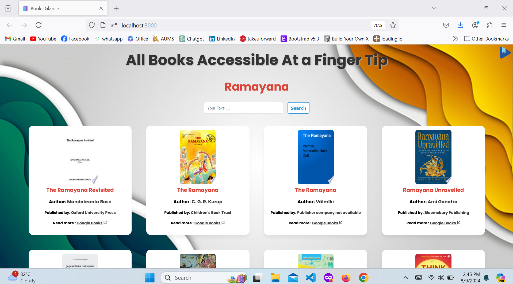

# Book Glance

## Introduction

Book Glance is a React-based web application that allows users to search for books using the Google Books API. With a user-friendly interface, Book Glance provides detailed information about books, including titles, authors, publishers, and preview links. Users can explore book details, view images, and get more information about their favorite books in a visually appealing format.



## How to Run the App

### Prerequisites

1. **Node.js**: Ensure that Node.js is installed on your machine. You can download it from [nodejs.org](https://nodejs.org/).

2. **Git**: Make sure Git is installed to manage your code repository. Download it from [git-scm.com](https://git-scm.com/).
   
3. **Google Books API**: Ensure that you have google book api with you. You can get the api and documentation from [googlebooks.com](https://developers.google.com/books).

### Setup

1. **Clone the Repository**

   Clone the repository to your local machine using the following command:

   ```bash
   git clone https://github.com/arunsah10/Book-Glance.git
   ```

2. **Navigate to the Project Directory**

   Change to the project directory:

   ```bash
   cd Book-Glance
   ```

3. **Install Dependencies**

   Install the required dependencies using npm:

   ```bash
   npm install
   ```

4. **Configure Environment Variables**

   Create a `.env` file in the root of the project directory and add your Google Books API key. It should look like this:

   ```
   REACT_APP_API_KEY=your_google_books_api_key
   ```

   Replace `your_google_books_api_key` with your actual API key.

5. **Run the Application**

   Start the development server with:

   ```bash
   npm start
   ```

   The application should now be running at `http://localhost:3000`.

## Application of

- **Author**: Arun Kumar Sah
- **Copyright**: © 2024 Arun Kumar Sah. All rights reserved.

